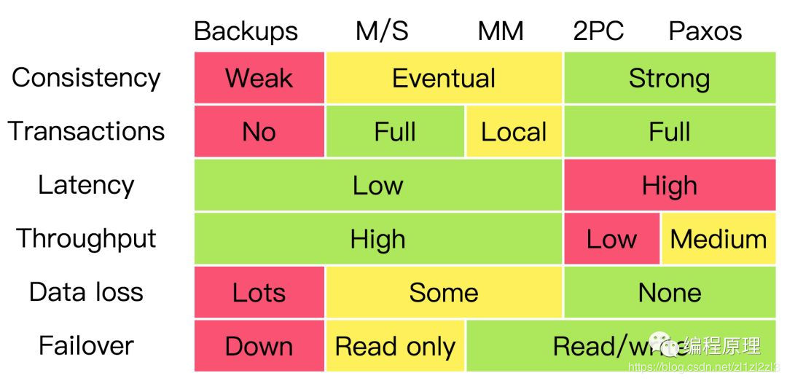

# 分布式一致性

## [WhatIs](WhatIs.md)

## 策略
* ACID 强一致性 
* CAP 分布式一致性 
* BASE 弱一致性 



## 一致性算法
* CALM （Consistency and Logical Monotonicity）
```md
主要描述的是分布式系统中单调逻辑与一致性的关系。

在分布式系统中，单调的逻辑都能保证 “最终一致性”，这个过程中不需要依赖中心节点的调度

任意分布式系统，如果所有的非单调逻辑都有中心节点调度，那么这个分布式系统就可以实现最终“一致性”
```
* CRDT(Conflict-Free Replicated Data Types)
```md
A comprehensive study of Convergent and Commutative Replicated Data Types.

基于状态(state-based)：
  即将各个节点之间的CRDT数据直接进行合并，所有节点都能最终合并到同一个状态，数据合并的顺序不会影响到最终的结果。
基于操作(operation-based)：
  将每一次对数据的操作通知给其他节点。只要节点知道了对数据的所有操作（收到操作的顺序可以是任意的），就能合并到同一个状态。
```
* Paxos
* Raft
* Gossip 是一种去中心化的分布式协议

## 协议
* HATs(Highly Available Transactions)
* ZAB(Zookeeper Atomic Broadcast)

## 实现
* [分布式事务 - 解决的是「 垂直 」问题](DS-transaction/README.md)
* [共识 - 解决的是「 水平 」问题](DS-consensus/README.md)


