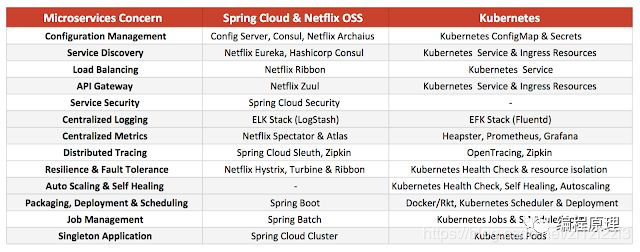
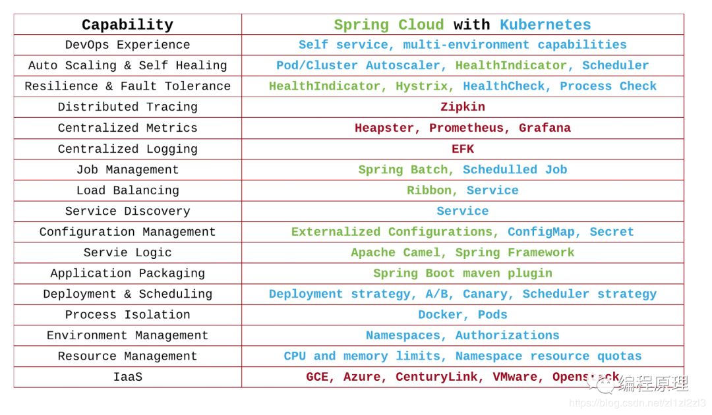

# 工程应用


* 资源调度
```md
弹性伸缩
网络管理
故障快照
```
* 流量调度
```md
负载均衡
网关设计
流量管理
流控控制
```
* 服务调度
```md
注册中心
版本管理
服务编排
服务控制
  发现
    网关接入
    健康检查
  降级
    降低一致性约束
    关闭非核心服务
    简化功能
  熔断
  幂等
    全局一致性ID
    Snowflake
```
* 数据调度
```md
状态转移 分离状态至全局存储，请求转换为无状态流量
分库分表 数据横向扩展
分片分区 分片分区
```
* 自动化运维
```md
配置中心
  switch
  diamend
部署策略
  停机部署
  滚动部署
  蓝绿部署
  灰度部署
  A/B测试
作业调度
  SchedulerX
  Spring定时任务
应用管理
  应用重启
  应用下线
  日志清理
```
* 容错处理
```md
重试设计
事务补偿
```
* 全栈监控
```md
基础层 CPU，IO，内存，线程，吞吐
中间件 分布式系统接入了大量的中间件平台，中间件本身的健康情况也需要监控
应用层 
  性能监控
  业务监控
监控链路
  zipkin/eagleeye
  sls
  goc
  Alimonitor
```
* 故障恢复
```md
应用回滚
基线回退 应用服务回滚后，代码基线也需要revert到前一版本。
版本回滚 整体回滚需要服务编排，通过大版本号对集群进行回滚。
```
* 性能调优
```md
分布式锁
高并发
异步
```



