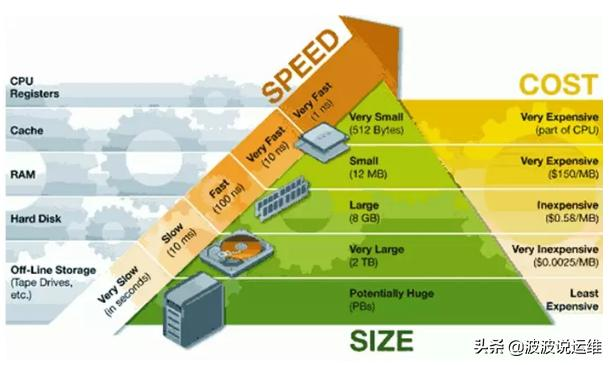
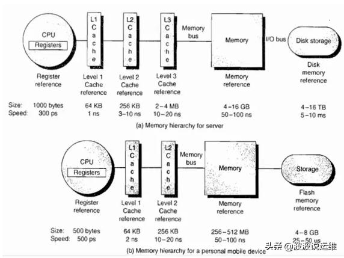

# Storage




* 寄存器
* 内存
* Cache
```md
即高速缓冲存储器，是位于CPU与主内存间的一种容量较小但速度很高的存储器。
```
```md
Cache 又分为一级 Cache(L1 Cache) 和二级Cache(L2 Cache)，
L1 Cache 集成在CPU内部，
L2 Cache早期一般是焊在主板上，现在也都集成在CPU内部，常见的容量有256KB或512KB L2 Cache。
```
* [磁盘](disk.md)