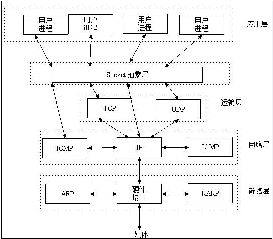

# What Is Socket ?
```md
Socket 不是协议，工作在 OSI 模型会话层（第5层），
为了方便大家直接使用更底层协议（一般是 TCP 或 UDP ）而存在的一个抽象层。

最早的一套 Socket API 是 Berkeley sockets ，采用 C 语言实现。
它是 Socket 的事实标准，POSIX sockets 是基于它构建的，
多种编程语言都遵循这套 API，在 JAVA、Python 中都能看到这套 API 的影子。

Socket是应用层与TCP/IP协议族通信的中间软件抽象层，它是一组接口。
在设计模式中，Socket其实就是一个门面模式，它把复杂的TCP/IP协议族隐藏在Socket接口后面，
对用户来说，一组简单的接口就是全部，让Socket去组织数据，以符合指定的协议。
```


## vs. TCP/IP
```md
TCP/IP只是一个协议栈，就像操作系统的运行机制一样，必须要具体实现，同时还要提供对外的操作接口。
这个就像操作系统会提供标准的编程接口，比如win32编程接口一样，
TCP/IP也要提供可供程序员做网络开发所用的接口，这就是Socket编程接口。
```
