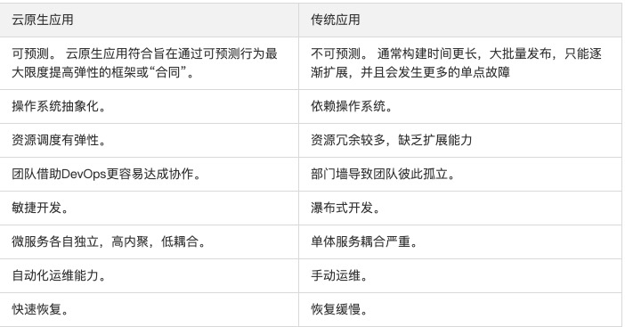

# What Is Cloud Native?
```md
云原生不是一个产品，而是一套技术体系和一套方法论，而数字化转型是思想先行，从内到外的整体变革。
更确切地说，它是一种文化，更是一种潮流，是云计算的一个必然导向。
```
```md
在容器技术、可持续交付、编排系统等开源社区的推动下，以及微服务等开发理念的带动下，应用上云已经是不可逆转的趋势。
随着云化技术的不断进展，云原生的概念也应运而生。
```
```md
云原生（Cloud Native）的概念，由来自Pivotal的MattStine于2013年首次提出，被一直延续使用至今。
这个概念是Matt Stine根据其多年的架构和咨询经验总结出来的一个思想集合，并得到了社区的不断完善。
```
```md
内容非常多，包括DevOps、持续交付（Continuous Delivery）、微服务（MicroServices）、
敏捷基础设施（Agile Infrastructure）和12要素（The Twelve-Factor App）等几大主题。
不但包括根据业务能力对公司进行文化、组织架构的重组与建设，也包括方法论与原则，还有具体的操作工具。
```
```md
采用基于云原生的技术和管理方法，可以更好地把业务生于“云”或迁移到云平台，从而享受“云”的高效和持续的服务能力。
```
```md
云并非把原先在物理服务器上跑的东西放到虚拟机里跑，真正的云化不仅是基础设施和平台的事情，
应用也要做出改变，改变传统的做法，实现云化的应用——应用的架构、应用的开发方式、应用部署和维护技术都要做出改变，
真正的发挥云的弹性、动态调度、自动伸缩……一些传统IT所不具备的能力。
这里说的“云化的应用”也就是“云原生应用”。
```
## 云原生计算基金会（CNCF）
```md
CNCF，即云原生计算基金会，2015年由谷歌牵头成立，基金会成员目前已有一百多企业与机构，包括亚马逊、微软、思科等巨头。
目前CNCF所托管的应用已达14个。
```
* CNCF(云原生计算基金会)认为云原生系统需包含的属性：
```md
1. 容器化封装：
    以容器为基础，提高整体开发水平，形成代码和组件重用，简化云原生应用程序的维护。
    在容器中运行应用程序和进程，并作为应用程序部署的独立单元，实现高水平资源隔离。
2. 自动化管理：
    统一调度和管理中心，从根本上提高系统和资源利用率，同时降低运维成本。
3. 面向微服务：
    通过松耦合方式，提升应用程序的整体敏捷性和可维护性。
```
```md
正因为如此，你可以专注于创新，解决业务问题，而不是把时间花在“静态、不灵活的传统架构”存在的许多技术问题。
```

## 云原生的四要素：持续交付、DevOps、微服务、容器
* 持续交付——缩小开发者认知，灵活开发方向
* 微服务——内聚更强，更加敏捷
* 容器技术——使资源调度、微服务更容易
* DevOps——以终为始，运维合一

## Compare
