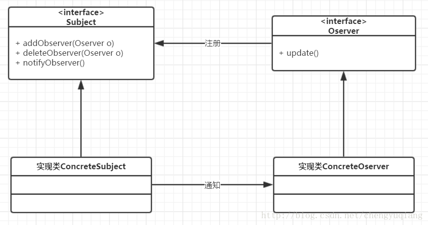

# Observer DP
```md
当一个对象的状态发生改变时，所有依赖于它的订阅者都会收到通知
```
* 场景
```md
关联行为场景
事件多级触发场景
跨系统消息交互场景
	例如：
    消息队列、事件总线
	Android开发：RxJava、Eventbus等等…
```
## Model


### 角色
* 被观察者->Observable（目标对象）
```md
使用泛型传入数据 且提供三个方法和持有观察者引用，维护观察者
```
* 具体被观察者 提供更新数据的方法
* 观察者->Observer 具体观察者


## 应用


