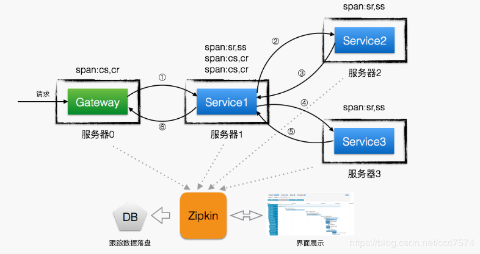

# [ZipKin](https://zipkin.io/)
```md
是一个开放源代码分布式的跟踪系统，每个服务向zipkin报告计时数据，
zipkin会根据调用关系通过Zipkin UI生成依赖关系图。

由 Twitter 开源。
```
```md
Zipkin提供了可插拔数据存储方式：In-Memory、MySql、Cassandra以及Elasticsearch。
```

## 概念
* Trace
```md
一个完整Trace 由一组Span组成，这一组Span必须具有相同的TraceID。
Span具有父子关系，处于子节点的Span必须有parent_id，Span由一组 Annotation和BinaryAnnotation组成。
整个Trace Tree通过Trace Id、Span ID、parent Span ID串起来的。
```
```md
Trace ID 起始(根)服务生成的TraceID
    Span ID：调用下游服务时所生成的Span ID
    Parent Span ID：父Span ID
    Is Sampled：是否需要采样
    Flags：告诉下游服务，是否是debug Reqeust
```
* Span
```md
表示一次完整RPC调用，是由一组Annotation和BinaryAnnotation组成。
是追踪服务调用的基本结构，多span形成树形结构组合成一次Trace追踪记录。Span是有父子关系的。
```
```md
什么时候生成?
    服务接受到 Request时，若当前Request没有关联任何Span，便生成一个Span，包括：Span ID、TraceID
    向下游服务发送Request时，需生成一个Span，并把新生成的Span的父节点设置成上一步生成的Span
```
* Annotation 
```md
表示某个时间点发生的Event
```
```md
cs：Client Send 请求
sr：Server Receive到请求
ss：Server 处理完成、并Send Response
cr：Client Receive 到响应
```
```md
什么时候生成?
     客户端发送Request、接受到Response、服务器端接受到Request、发送 Response时生成。
     Annotation属于某个Span，需把新生成的Annotation添加到当前上下文里Span的annotations数组里
```
* BinaryAnnotation
```md
存放用户自定义信息，比如：sessionID、userID、userIP、异常等
1. 在任意需要记录自定义跟踪信息时都可生成。
    比如：异常、SessionID等。如Annotation一样，BinaryAnnotation也属于某个Span。
    需把新生成的BinaryAnnotation，添加到当前上下文里Span的binary_annotations数组。

2. 如果需要添加相应的信息，可以使用tracer埋点技术来实现
    在相应需要显示到binaryAnnotation的代码地方加上埋点，之后会自动像zipkin提交信息，用以显示用户需要的自定义信息。
```

## Design
