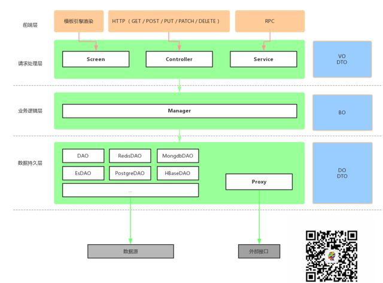

# RPC （Remote Procedure Call）— 远程过程调用

## [What Is](WhatIs.md)



## [Design](design/README.md)

## Implement
* Apache Dubbo
* [Google gRPC](https://grpc.io/) 
```md
基于HTTP/2和protobuf的RPC框架。
```
* [Brpc](https://github.com/SunnnyChan/sc.drill-code/tree/master/infra/brpc)
* Apache Avro
* rpcx Go语言
* Apache Thrift
* Spring RPC
* [Sofa-pbrpc](https://github.com/baidu/sofa-pbrpc)

* [NettyRpc](https://github.com/luxiaoxun/NettyRpc)
```md
Zookeeper、Netty和Spring写了一个轻量级的分布式RPC框架
	可以算是一个简易版的dubbo
代码，写的干净简单
	可以学习一下
```

```md
REST
	无状态的数据传输结构，适用于通用、快速迭代和标准化语义的场景

GraphQL
	请求者可以自定义返回格式，某些程度上可以减少前后端联调成本
		对外开放 API 或者拥有完整配套的场景
			使用 GraphQL 是比较理想的
		但对于快速迭代，平台又不够成熟的团队，继续使用标准 Http 接口可以更快完成项目

gRPC
	轻量的传输方式
		特殊适合对性能高要求或者环境苛刻的场景，比如 IOT
	是服务端交互的首选

Webhooks
	推送服务，主要用于服务器主动更新客户端资源的场景
	场景
		对于第三方平台验权、登陆等 没有前端界面做中转的场景
			或者强安全要求的支付场景等，适合用 Webhooks 做数据主动推送
		说白了就是在前端无从参与，或者因为前端安全问题不适合参与时，就是 Webhooks 的场景
```
```md
Thrift适用于程序对程序静态的数据交换，要求schema预知并相对固定
	目前Thrift的优势在于更多的语言支持和相对成熟；
Avro在Thrift基础上增加了对schema动态的支持且性能上不输于Thrift
Avro显式schema设计使它更适用于搭建数据交换及存储的通用工具和平台，特别是在后台
```
```md
（Binary）RPC or Restful
		以Apache Thrift为代表的二进制RPC
			支持多种语言（但不是所有语言），四层通讯协议，性能高，节省带宽
		相对Restful协议，使用Thrift RPC
			在同等硬件条件下，带宽使用率仅为前者的20%，性能却提升一个数量级
			但是这种协议最大的问题在于，无法穿透防火墙。
		以Spring Cloud为代表所支持的Restful 协议
			优势在于能够穿透防火墙，使用方便，语言无关
				基本上可以使用各种开发语言实现的系统，都可以接受Restful 的请求
			但性能和带宽占用上有劣势
	所以，业内对微服务的实现，基本是确定一个组织边界
		在该边界内，使用RPC
			边界外，使用Restful
		这个边界，可以是业务、部门，甚至是全公司
```

## [RPC HA](HA/README.md)

## [RPC Development](dev/README.md)

## Resources
* [REST vs RPC](https://www.linkedin.com/pulse/rest-vs-rpc-soa-showdown-joshua-hartman)
