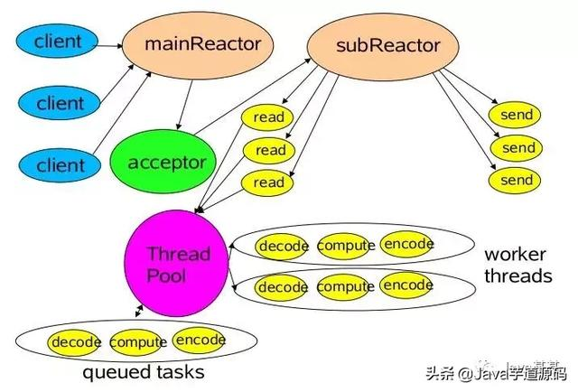

# NIO


## Model
### Reactor 模型

* Reactor单线程模型

```md
Reactor线程是个多面手，负责多路分离套接字，Accept新连接，并分派请求到处理器链中。
该模型 适用于处理器链中业务处理组件能快速完成的场景。
不过，这种单线程模型不能充分利用多核资源，所以实际使用的不多。
```
```md
对于一些小容量应用场景，可以使用单线程模型，但是对于高负载、大并发的应用却不合适:
1. 一个NIO线程同时处理成百上千的链路，性能上无法支撑。
    即便 NIO线程的 CPU负荷达到100%，也无法满足海量消息的编码、解码、读取和发送
2. 当NIO线程负载过重之后，处理速度将变慢，这会导致大量客户端连接超时，超时之后往往进行重发，这更加重了NIO线程的负载，
    最终导致大量消息积压和处理超时，NIO线程会成为系统的性能瓶颈；
3. 可靠性问题。
    一旦NIO线程意外跑飞，或者进入死循环，会导致整个系统通讯模块不可用，不能接收和处理外部信息，造成节点故障。
```
* Reactor多线程模型

```md
Reactor 多线程模型与单线程模型最大区别就是有一组 NIO线程处理 I/O操作
```
```md
1. 有一个专门的NIO线程--acceptor 线程于监听服务端，接收客户端的TCP连接请求。
2. 网络I/O操作--读、写等由一个NIO线程池负责，线程池可以采用标准的JDK线程池实现，
    它包含一个任务队列和N个可用的线程，由这些NIO线程负责消息的读取、解码、编码和发送
3. 1个 NIO线程可以同时处理 N条链路，但是1个链路只对应1个NIO线程，防止发生并发操作问题。
```
```md
在绝大多数场景下，Reactor多线程模型都可以满足性能需求；
但是，在极特殊应用场景中，一个NIO线程负责监听和处理所有的客户端连接可能会存在性能问题。
例如百万客户端并发连接，或者服务端需要对客户端的握手信息进行安全认证，认证本身非常损耗性能。
这类场景下，单独一个Acceptor线程可能会存在性能不足问题，
为了解决性能问题，产生了第三种Reactor线程模型--主从Reactor多线程模型。
```
* 主从Reactor多线程模型

```md
服务端用于接收客户端连接的不再是1个单独的NIO线程，而是一个独立的NIO线程池。
Acceptor 接收到客户端TCP连接请求处理完成后（可能包含接入认证等），
将新创建的 SocketChannel 注册到I/O线程池（sub reactor线程池）的某个I/O线程上，由它负责SocketChannel的读写和编解码工作。
```
```md
Acceptor线程池只用于客户端的登录、握手和安全认证，一旦链路建立成功，
就将链路注册到后端 subReactor 线程池的I/O线程上，有 I/O线程负责后续的 I/O操作。
```
```md
第三种模型比起第二种模型，是将Reactor分成两部分，mainReactor 负责监听 server socket，accept新连接，
并将建立的 socket分派给 subReactor。
subReactor 负责多路分离已连接的 socket，读写网 络数据，对业务处理功能，其扔给worker线程池完成。
通常，subReactor 个数上可与 CPU个数等同。
```
