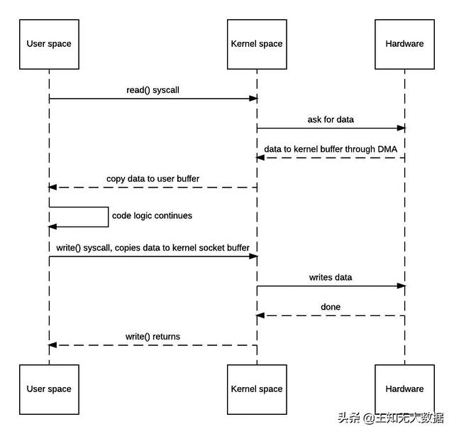
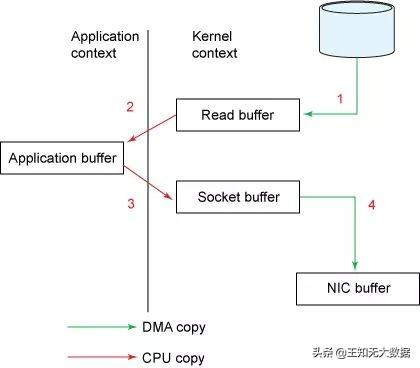
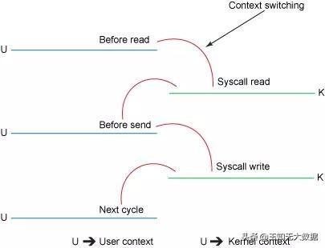

# 网络 IO

## 网络 IO 流程
```md
1. JVM 向 OS 发出 read()系统调用，触发上下文切换，从用户态切换到内核态。
2. 从外部存储（如硬盘）读取文件内容，通过直接内存访问（DMA）存入内核地址空间的缓冲区
3. 将数据从内核缓冲区拷贝到用户空间缓冲区，read()系统调用返回，并从内核态切换回用户态。
4. JVM 向OS 发出write()系统调用，触发上下文切换，从用户态切换到内核态。
5. 将数据从用户缓冲区拷贝到内核中与目的地Socket关联的缓冲区。
6. 数据最终经由 Socket 通过 DMA传送到硬件（如网卡）缓冲区，write()系统调用返回，并从内核态切换回用户态。
```





* [零拷贝（Zero-copy）](zero-copy.md)

## 网络 IO Model
* BIO
* [NIO](NIO.md)
* [AIO](AIO.md)

## 


## Reference
* [Scalable IO in Java](http://gee.cs.oswego.edu/dl/cpjslides/nio.pdf)