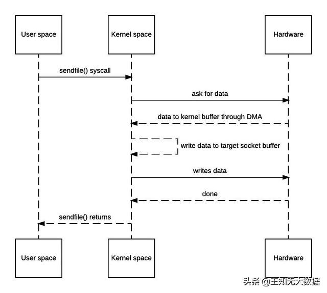
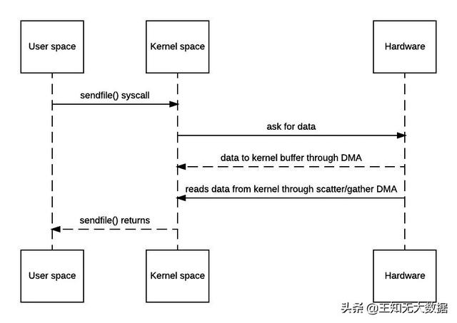
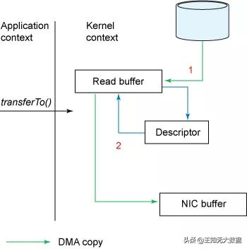
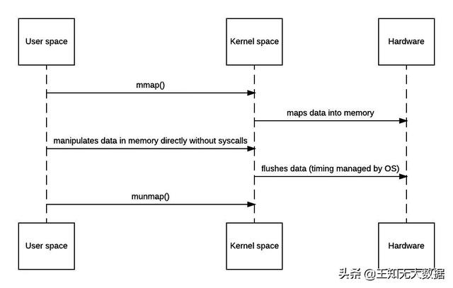

# Zero-copy
```md
传统的网路IO方法，共发生了4次模式切换，并且数据也被来回拷贝了4次。

上下文切换是CPU密集型的工作，数据拷贝是I/O密集型的工作。
如果一次简单的传输就要像上面这样复杂的话，效率是相当低下的。
零拷贝机制的终极目标，就是消除冗余的上下文切换和数据拷贝，提高效率。
```
## “基础的”零拷贝机制
```md
实际上从内核空间到用户空间的来回复制是没有意义的，数据应该可以直接从内核缓冲区直接送入Socket缓冲区。
零拷贝机制就实现了这一点。不过零拷贝需要由操作系统直接支持，不同OS有不同的实现方法。
大多数Unix-like 系统都是提供了一个名为 sendfile() 的系统调用。
```

```md
可见确实是消除了从内核空间到用户空间的来回复制，
因此“zero-copy”这个词实际上是站在内核的角度来说的，并不是完全不会发生任何拷贝。
```

## 对Scatter/Gather的支持
```md
在“基础”零拷贝方式的时序图中，有一个“write data to target socket buffer”的回环。
这是因为在一般的Block DMA方式中，源物理地址和目标物理地址都得是连续的，
所以一次只能传输物理上连续的一块数据，每传输一个块发起一次中断，直到传输完成，所以必须要在两个缓冲区之间拷贝数据。
```
```md
而Scatter/Gather DMA方式则不同，会预先维护一个物理上不连续的块描述符的链表，描述符中包含有数据的起始地址和长度。
传输时只需要遍历链表，按序传输数据，全部完成后发起一次中断即可，效率比Block DMA要高。
也就是说，硬件可以通过Scatter/Gather DMA直接从内核缓冲区中取得全部数据，不需要再从内核缓冲区向Socket缓冲区拷贝数据。
因此上面的时序图还可以进一步简化。
```




## 对内存映射（mmap）的支持
```md
上面讲的机制看起来一切都很好，但它还是有个缺点：如果我想在传输时修改数据本身，就无能为力了。
不过，很多操作系统也提供了内存映射机制，对应的系统调用为mmap()/munmap()。
通过它可以将文件数据映射到内核地址空间，直接进行操作，操作完之后再刷回去。
```

```md
当然，天下没有免费的午餐，上面的过程仍然会发生4次上下文切换。
另外，它需要在快表（TLB）中始终维护着所有数据对应的地址空间，直到刷写完成，因此处理缺页的overhead也会更大。
在使用该机制时，需要权衡效率。
```
```md
NIO框架中提供了MappedByteBuffer用来支持mmap。
它与常用的DirectByteBuffer一样，都是在堆外内存分配空间。
相对地，HeapByteBuffer在堆内内存分配空间。
```
## 应用
* Netty
* 在Kafka中的应用
* 在Spark中的应用
```md
零拷贝机制在Spark Core 中主要就被用来优化 Shuffle过程中的溢写逻辑。
由于Shuffle过程涉及大量的数据交换，因此效率当然是越高越好。
```

## Implement
* [Java Zero-copy](https://github.com/SunnnyChan/knowledge-Sys-of-Java/tree/master/java-network/zero-copy)
