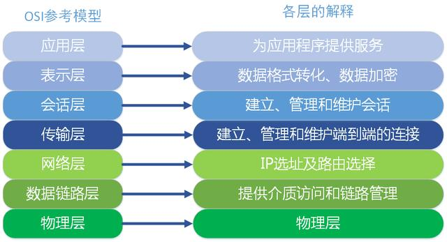

# OSI （Open System Interconnect），即开放式系统互联
```md
一般都叫OSI参考模型，是ISO（International Organization for Standardization，国际标准化组织）组织在1985年研究的网络互连模型。
```
```md
OSI定义了网络互连的七层框架（物理层、数据链路层、网络层、传输层、会话层、表示层、应用层），即ISO开放互连系统参考模型。
```
```md
每一层实现各自的功能和协议，并完成与相邻层的接口通信。
OSI的服务定义详细说明了各层所提供的服务。
某一层的服务就是该层及其下各层的一种能力，它通过接口提供给更高一层。
各层所提供的服务与这些服务是怎么实现的无关。
```

