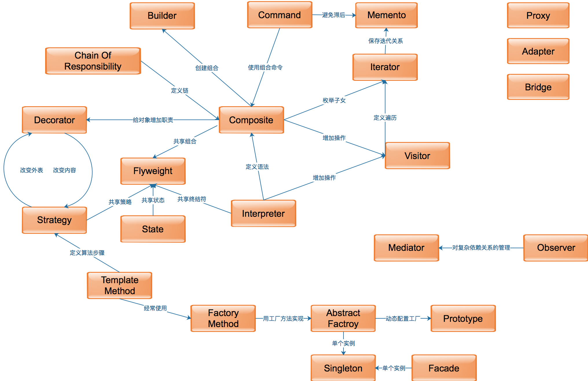

# OOP Design Pattern



## Creational
* Builder
* Prototype
* Factory 工厂方法模式
* Abstract Factory 抽象工厂模式
* [Singleton 单列模式](Creational-DP/Singleton.md)

## Structural
* Adapter
* Bridge 桥接模式
* Composite 组合模式
* Decorator
* Facade 外观模式
* Flyweight 享元模式
* Proxy 代理模式

## Behavioral
* Chain of responsibility 责任链模式 
* Command 命令模式
* Interpreter 解释器模式
* Iterator 迭代子模式
* Mediator 中介者模式
* Memento 备忘录模式
* State 状态模式
* [Observer 观察者模式]((Behavioral-DP/Observer.md)
* [Strategy](Behavioral-DP/Strategy.md)

* [Template method 模板方法模式](Behavioral-DP/Template_Method-DP.md)

* Visitor 访问者模式


## Compare
```md
食堂里厨房最远的窗口没熬白菜了，要告诉厨房，快送过来
责任链模式
	一个窗口一个窗口地传话，一直传到食堂，食堂一看不妙，赶快做好送过去
中介者模式
	专门派一个人负责传话，任何窗口没菜了，就要这个人赶快去厨房催
观察者模式
	厨房那边派一个盯着，看哪个窗口没菜了就开始大声嚷嚷
```