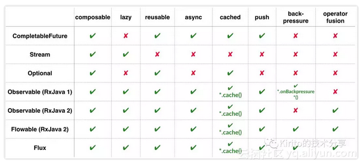

# Reactive Programming

## [What Is Reactive Programming ?](WhatIs.md)

## Model
### 标准
* Composable（可组合）
* Lazy（惰性执行）
* Reusable（可复用）
* Asynchronous（异步）
* Cacheable（可缓存）
* Push or Pull（推拉模型）

* [Backpressure（回压）](BackPressure.md)

* Operator fusion（操作融合）

## Design
* [Event](Event.md)
* [Reactive Streams](Reactive-Streams.md)

* Observable 可被观察的事物，也就是事件和数据流
* Observer 观察流的事物
* Operator 操作符，对流进行连接和过滤等等操作的事物
```java
Observable<String> myStrings =
	Observable.just("Alpha", "Beta", "Gamma", "Delta", "Epsilon");
    myStrings.map(s -> s.length())
        .subscribe(s -> System.out.println(s));
```
```md
myStrings 就是Observable
map(s -> s.length()) 就是Operator
subscribe(s -> System.out.println(s)) 就是Observer
```

## Implement
```md
Reactor
RxJava
Java9 Flow API
RxJs
Akka-Streams
Vert.x
MongoDB
Slick
Ratpack
```



## Reference
* [Why Reactive?](https://github.com/SunnnyChan/sc.ebooks)
* [Reactive Programming 一种技术，各自表述](https://yq.aliyun.com/articles/617466)
