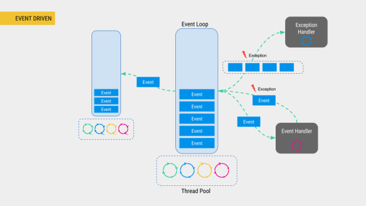

# What Is Event-Driven Programming ?
```md
在事件驱动的程序设计中，程序中的许多部分可能在完全不可预料的时刻被执行。
往往这些程序的执行是由用户与正在执行的程序的互动激发所致。

基于事件驱动的程序设计在图形用户界面（GUI）出现很久前就已经被应用于程序设计中，
可是只有当图形用户界面广泛流行时，它才逐渐形演变为一种广泛使用的程序设计模式。
```

## 优点
```md
相对传统轮询模式:
可扩展性好 分布式的异步架构，事件处理器之间高度解耦，可以方便扩展事件处理逻辑
高性能 基于队列暂存事件，能方便并行异步处理事件
```

## 


* Event Loop
```md
事件循环接受，维护和管理发往定义的处理程序的事件。事件被传递到处理它的相应处理程序。
处理程序可能成功响应事件或发生故障。失败也作为另一个事件传递给事件循环。
异常的处理程序（显示为​​异常处理程序）决定相应地做出反应。
Java中的事件循环通常执行线程池。
可以通过多个事件循环组织更复杂的系统。
```
* Events
* Event Handlers

* Backpressure
```md

```

## Event-Driven vs Reactive
```md
事件驱动的编程处理围绕着事件，代码中的其他位置“监听”事件并响应事件发生时他们需要做的事情。
反应式编程处理数据，是事件驱动编程的特例。

事件：数据已更改。
事件处理程序：更改更多数据。
```
> [EVENT DRIVEN AND REACTIVE ARCHITECTURE](https://deepakpol.wordpress.com/2015/09/29/event-driven-and-reactive-architecture/)

