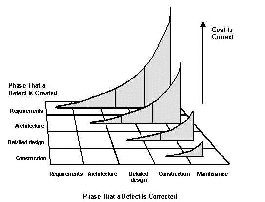

# 域模型（问题域模型）
## What?
```md
域模型（domain model）英文又称为问题域模型（problem space model）。
维基百科(Wikipedia)对它的定义是” A conceptual model of all the topics related to a specific problem” 
“域模型是针对某个特定问题的所有相关方面的抽象模型”。
要点：
第一是“特定问题”， 也即是说域模型是针对性某个问题域而言的， 脱离的这个特定问题，域模型的构建其实不存在一个最优或者是最合理的构建。
第二是抽象， 域模型是一个抽象模型， 不是对某个问题的各个相关方面的一个映射， 也不是解决方案的构建。
```
### Vs. 数据模型(logical data model) 
```md
数据模型实质上都归属于结果域模型（solution space model）, 是对某个问题域的解决方案的一个描述， 实质上是对解决方案的一个具体描述。
```
### Vs. 领域驱动设计（DDD, Domain Driven Design）
```md
DDD里提到的域模型实质上是结果域模型（Solution Space Model）, 不是问题域模型。

区别在于
前者的建立主要是为了统一我们对未知世界的了解， 也就是说我们需要统一思想， 搞清楚我们要解决什么问题和问题的本质。
而后者的主要是想解决针对近些年来敏捷开发模式中所普遍存在的对领域认知不完整而导致设计不合理的问题。

前者是一个对未知方向的探索过程，适用在一个相对较为模糊的命题，产出是对语言，边界和思路的统一。
后者是一个方法论，适用于具体一个项目， 产出是一个项目的数据模型。
```

## Why?
### 域模型的价值
* 统一思想
```md
很多时候，各个角色，如客户， 项目经理，设计师， 程序员， 销售， 文书， 服务等， 
都没有能够对要解决的问题有一个统一的认识，下游输出的结果和上游需要解决的问题脱节。

而域模型的核心价值在于统一项目中各个相关方对问题的认识， 从而避免此类问题发生。
需要强调域模型服务的对象是一个部门所有的成员。 
也就是说整个部门需要对我们要解决的问题有统一认知， 而不只是技术团队内部或者是技术和产品团队的统一。 
```
* 团队分工和合作
```md
一个域模型，需要准确的定义需要解决的问题的方方面面， 这些问题的方方面面，就形成了我们对团队分工的理解。
不同于我们日常的从组织结构出发定义并解决问题的方法，
我们对问题域的准确定义往往能够帮助我们找到组织结构中的弱点， 从而帮助我们建立最合适的组织结构或者是最合适的交流渠道。   
```
* 反映变化
```md
在电商领域里，随着消费人群需求，市场环境，和竞争对手的变化，我们所要解决的问题也在不断的变化。

举一个具体的例子， 我们一般都会定义生态系统的参与者。 
最常见到的域模型定义里会有买家，卖家和小二。 
随着时间进化， 因为运营流量， 我们需要引入联盟站长概念， 因为要引入第三方研发， 我们引入ISV概念， 
因为要外包服务，我们需要引入定位和权限更细分的小二的角色， 等等。
```
* 域模型在大型软件设计项目中

```md
第一维横轴是时间轴， 描述错误解决的时间。
第二维纵轴也是时间轴， 描述错误产生的时间。 
第三维竖轴是解决错误所耗费的成本。
```
```md
描述了四种情形， 
第一种是代码错误， 发生在构建时间（construction）; 
第二种是设计错误， 发生在设计期间（design）;
第三种是需求错误， 发生在具体需求产生的期间（requirement）;
第四种是概念错误， 发生在“concept of operations ”（一个对整个系统的概念性描述）形成的时间（ConOps）。 

 随着时间增长，解决错误的成本不断增长。 而这里面最大的成本就是概念的错误。
``
### 总结
```md
所以我们一定要在一个项目最终形成概念的时候讨论域模型。 
搞清楚我们需要解决的问题如何能够毫无歧义的表达出来。 这就是域模型的价值所在。   
```

## 主要概念
* 域（domain）
* 子域（subdomain）
* 语境（context）
```md
是一个特定人群在讨论的问题域是所形成的上下文。
特定人群不是以团队或者是项目为边界划分的人群， 而是以知识为边界来划分的人群。
也就是说上下文不是普遍存在的， 而是存在于一个人群内部的，并且这些上下文大多是以隐形知识（Tacit Knowledge）的方式而存在的。

什么是隐形知识呢， 就是还没有被总结整理归纳沉淀的知识。
```
* 特定语境（Bounded context）
```md
是把上下文限定到某个特定的边界之内。 这个边界是由某个特定人群和他们所讨论的问题子域来决定的。
```
* 语境映射（Context Mapping）
```md
不同的语境之间会有交互， 那么从一个语境到另一个语境的翻译过程就是语境映射。
```
* 域语言（Ubiquitous  Language）
```md
是一个团队在某个特定语境之下建立的交流语言。
```
* 实体(Entity)
* 触发事件（Domain　Event）
* 数值对象（Value Object）
* 实体类型（Entity　Type）
* 关系（Relationship）
* 场景（Scenario）
```md
场景是问题域中的一个问题实例。也就是说我们要解决的具体问题。
```
* 核心场景（Core Scenario）
```md
是问题域中的不可以牺牲的问题实例。
牺牲场景，也就是不把某一类场景作为有必要解决的问题， 是一个既需要经验又需要Vision的难题。
我们用户痛点到底在哪里，解决这些痛点是否对我们的未来有决定性意义。
```
```md
举个例子：亚马逊的Jeff　Bezos认定Mobile不是决定性的，　未来Device是决定性的。　
所以有些Mobile shopping场景就不被认为是核心场景。而某些尚未成熟的device　shopping场景反倒被认为是核心场景。
这就是一个商业判断。当然这个判断正确与否还有待时间证实。
我们做技术的一般不需要做出这样的判断，但是我们必须清晰的了解这样的判断。　只有这样我们才能和业务团队保持同样的目标。
```
## 设计方法
### 典型用户和核心场景
```md
问题描述比较实用的方法就是微软创建的Scenario Driven Design的方法， 用自然语言把一个问题描述清楚。
这个描述有两个部分， 一个是典型用户（Persona）， 另一个是场景（Scenario）。
```
### 实体类型抽取
```md
有了核心场景，就可以先抽取实体，然后再抽象出实体类型。
```
### 模型表述
```md
实体类型的表述有几个传统的方式，就是通过1. 自然语言描述， 2. 关系模型，和3.状态图。 
其中文字描述除了前面的典型用户描述和场景描述之外，还有对实体模型的定义。
```
### 模型验证
#### 场景回放
```md
验证的过程就像做一个头脑实验， 用模型来返回去印证场景。
一个场景中隐性的存在着一些实体类型只有通过模型验证才能找到。
```
#### 实体类型生命周期
```md
通过场景验证之后， 我们基本上可以确定一个域模型中所有定义的实体类型是充分的。 
也就是说这些实体类型合在一起，可以精确的表述我们的问题域。  
那么下一个问题来了？ 这些实体类型是必要的吗？ 
举个例子来说， 我们到底需不需要定义产品这个实体类型？ 它和商品的区别在哪里？ 它和出价的区别又在哪里？
```
### 实体类型的定义
```md
有了前面的透彻理解，　我们就可以为实体类型下定义了。
```
### 域模型文档组织
```md
要讲背景知识，商业目标，然后将核心用户，核心场景，之后对问题域的第一层的实体类型定义并且给出域模型，实体状态图，和描述，
最后由浅入深再解释下个层次的域模型，文章附录应该提供必要的reference，尚未解决的问题，没有覆盖的部分，争议点等等。
```
## Reference
* [域模型](https://yq.aliyun.com/articles/2255)